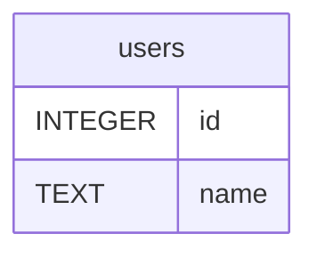

```mermaid
erDiagram

users {
    INTEGER id
    TEXT name
}
```

```sql
NULL       NULL値
INTEGER    符号付整数。1, 2, 3, 4, 6, or 8 バイトで格納
REAL       浮動小数点数。8バイトで格納
TEXT       テキスト。UTF-8, UTF-16BE or UTF-16-LEのいずれかで格納
BLOB       Binary Large OBject。入力データをそのまま格納
```