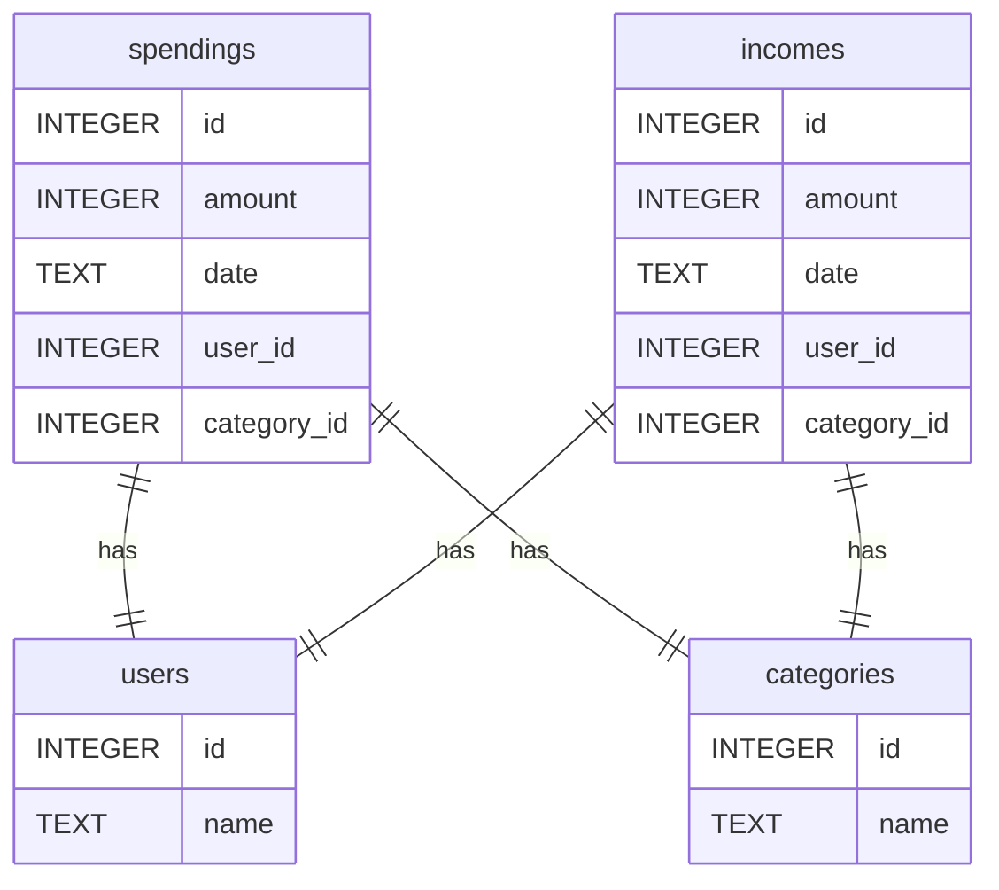

## ER図 表記メモ

```
"||" -> 1
"--" -> テーブルを繋げる線
"o{" -> 0 or n
```

## SQLite3 型種別

```sql
NULL       NULL値
INTEGER    符号付整数。1, 2, 3, 4, 6, or 8 バイトで格納
REAL       浮動小数点数。8バイトで格納
TEXT       テキスト。UTF-8, UTF-16BE or UTF-16-LEのいずれかで格納
BLOB       Binary Large OBject。入力データをそのまま格納
```

## SQlite３　コマンドメモ

| コマンド | 意味 |
| --- | --- |
| .exit | SQLite3のプロセスを終了する |
| .tables | テーブルの一覧を表示 |
| .schema | テーブルの詳細を表示 |
| SELECT * FROM {テーブル名} | |
